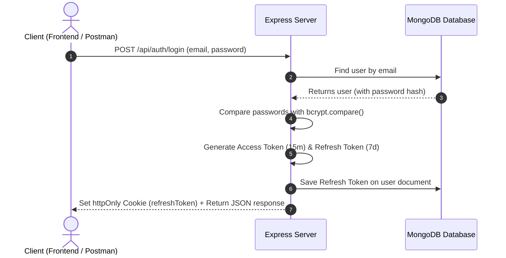
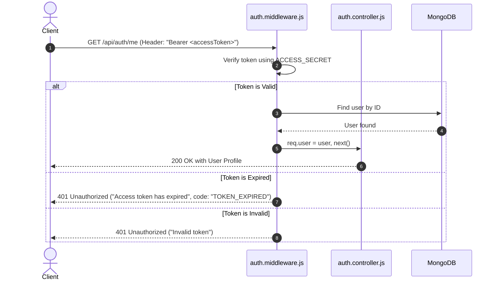
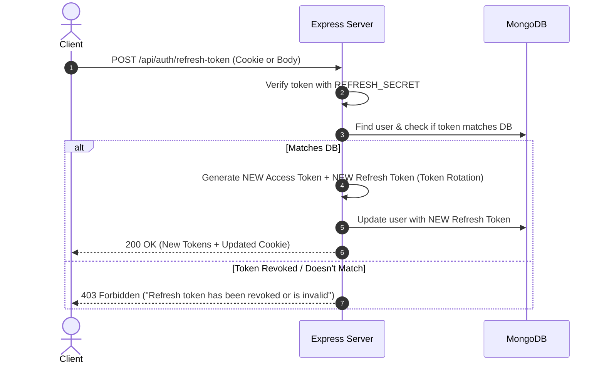
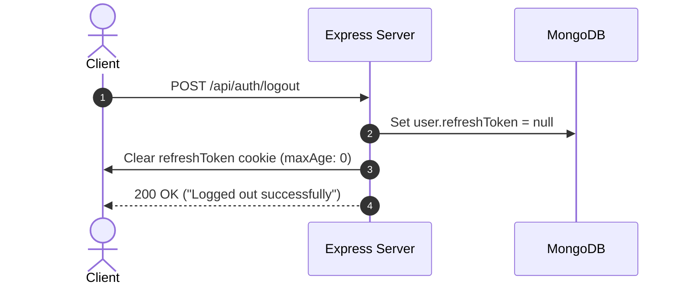

# Authentication Flow Guide (Access & Refresh Token)

This document explains how the authentication system in this project works, step-by-step, with simple diagrams and points.

---

## 1. Why Do We Use Two Tokens?

| Token | Lifespan | Secret Key | Purpose | Where Stored |
| :--- | :--- | :--- | :--- | :--- |
| **Access Token** | Short (15 min) | `ACCESS_SECRET` | Used to access protected APIs (`/me`, etc.) | Sent in `Authorization: Bearer <token>` |
| **Refresh Token** | Long (7 days) | `REFRESH_SECRET` | Used only to get a new access token when it expires | Saved in Database + `httpOnly` Cookie |

### Why not just one token?
- If an **Access Token** is stolen, the attacker can only use it for **15 minutes**.
- The **Refresh Token** is kept safe in the database and an `httpOnly` cookie (JavaScript cannot access it, preventing XSS attacks).
- If a user logs out, we delete the refresh token from the database, immediately revoking access.

---

## 2. The 4 Main Flows

### Flow 1: Register / Login

When a user signs up or logs in with their email and password:



#### Key Points:
1. Server validates email and checks password hash using `bcrypt.compare()`.
2. Server generates two tokens:
   - `accessToken` signed with `ACCESS_SECRET`.
   - `refreshToken` signed with `REFRESH_SECRET`.
3. The `refreshToken` is saved into the user's document in MongoDB.
4. The server sends:
   - `refreshToken` in an **`httpOnly` cookie** (secure against XSS).
   - Both tokens in the **JSON response** (for mobile apps or Postman).

---

### Flow 2: Accessing Protected Routes (`GET /api/auth/me`)

When an authenticated user requests a protected endpoint:



#### Key Points:
1. Client sends the access token in header: `Authorization: Bearer <accessToken>`.
2. `auth.middleware.js` verifies the token with `ACCESS_SECRET`.
3. If the token is expired, it returns `code: "TOKEN_EXPIRED"`, signaling the client to refresh the token.
4. If valid, it attaches `req.user` and forwards the request to the controller.

---

### Flow 3: Refreshing Tokens (`POST /api/auth/refresh-token`)

When the 15-minute access token expires, the client asks for a new one without forcing the user to log in again:



#### Key Points:
1. Client sends the refresh token (automatically sent via cookie, or passed in JSON body).
2. Server verifies the signature using `REFRESH_SECRET`.
3. Server checks if the token in the database matches the incoming token:
   - If it matches $\to$ valid session.
   - If it doesn't match $\to$ token was revoked or reused by an attacker.
4. **Token Rotation**: The server generates **both** a new access token AND a new refresh token, updating the DB and cookie.

---

### Flow 4: Logout (`POST /api/auth/logout`)

When the user logs out:



#### Key Points:
1. Server clears the `refreshToken` in MongoDB (`refreshToken = null`).
2. Server instructs the browser to delete the cookie (`clearCookie`).
3. Now the old refresh token is completely useless, even if someone intercepted it.

---

## 3. Project File Map

```text
src/
├── config/
│   ├── config.js          # Loads environment variables (MONGO_URI, ACCESS_SECRET, REFRESH_SECRET)
│   └── db.js              # Connects to MongoDB
├── models/
│   └── user.model.js      # User schema (name, email, password [hidden], refreshToken [hidden])
├── utils/
│   └── auth.js            # Helpers: generateAccessToken(), generateRefreshToken(), cookie options
├── middleware/
│   └── auth.middleware.js # Protects routes by checking the Bearer Access Token
├── controllers/
│   └── auth.controller.js # Logic for register, login, refresh-token, logout, me
├── routes/
│   └── auth.routes.js     # Express routes mapping endpoints to controllers
└── app/
    └── app.js             # Configures Express, JSON parser, and Cookie parser
```

---

## 4. Summary of API Endpoints

| Method | Endpoint | Headers | Body / Cookie | Description |
| :--- | :--- | :--- | :--- | :--- |
| `POST` | `/api/auth/register` | None | `{ name, email, password }` | Registers user & returns token pair |
| `POST` | `/api/auth/login` | None | `{ email, password }` | Authenticates & returns token pair |
| `GET` | `/api/auth/me` | `Authorization: Bearer <accessToken>` | None | Returns logged-in user profile |
| `POST` | `/api/auth/refresh-token`| None | Cookie or `{ refreshToken }` | Rotates refresh token & returns new access token |
| `POST` | `/api/auth/logout` | None | Cookie or `{ refreshToken }` | Revokes refresh token & clears cookie |
